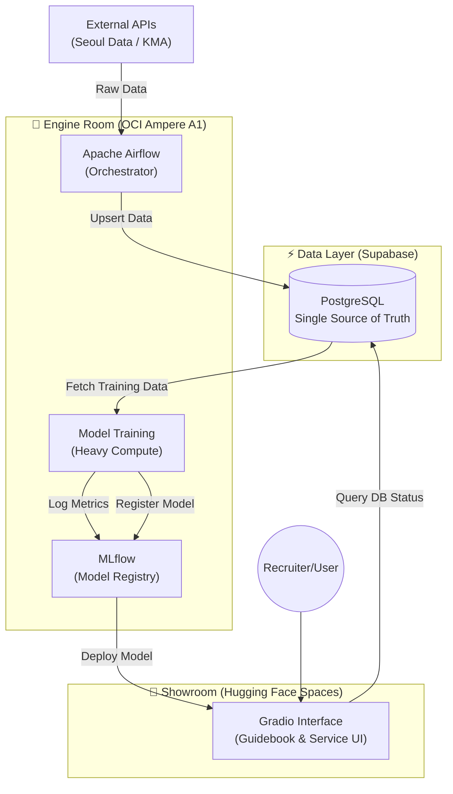

# Daily Seongsu (성수역 혼잡도 예측 서비스) - Professional MLOps Portfolio

**Target Goal**: 2027 Singapore Big Tech AI Logic / MLOps Engineer Recruitment.

**Daily Seongsu** is an end-to-end AI service designed to predict real-time crowding at Seongsu Station. It demonstrates a **Professional MLOps Pipeline** integrating **Hybrid Cloud Infrastructure** (OCI + Supabase + Hugging Face) and a **Dual-Purpose UI** architecture.

---

## 🏗️ System Architecture: The "Hybrid Engine"

We utilize a three-tier architecture to balance performance, scalability, and accessibility.



### 1. Engine Room (OCI Ampere A1)
- **Role**: Heavy lifting and Orchestration.
- **Components**: Apache Airflow (Dag Management), MLflow (Experiment Tracking), Docker Containers.
- **Hardware**: Oracle Cloud Infrastructure (ARM64).

### 2. Data Layer (Supabase)
- **Role**: Serverless Relational Database (PostgreSQL).
- **Features**: Robust `upsert` logic for data integrity, instant API generation.

### 3. Showroom (Hugging Face Spaces)
- **Role**: Public-facing Interface & Social Proof.
- **UI**: **Gradio** (Interactive MLOps Guidebook).
- **Goal**: High availability for global access (Recruiters, Users).

---

## 🗺️ MLOps Roadmap (Level 1 - 10)

### 🟢 Level 1: Cloud Data Engineering (COMPLETE)
- **Objective**: Establish a robust data pipeline replacing local files.
- **Tech Stack**: Python (Crawler), **Supabase (PostgreSQL)**, OCI.
- **Key Achievements**:
    - Migrated connection logic from `crawler/storage.py` (Local JSON) to `crawler/storage_supabase.py` (Cloud DB).
    - Implemented **Upsert Strategy** (Insert on Conflict Update) to prevent duplicate records.
    - Secured API Keys using `.env` environment variables.

### 🟡 Level 2: Data Warehouse & Preprocessing (TODO)
- **Objective**: Create a clean, ML-ready dataset.
- **Action**: Use Pandas to handle missing values and feature engineering (e.g., *IsHoliday*, *RainCondition*) directly from Supabase.

### ⚪ Level 3: Dual-Purpose UI (Interactive Guidebook)
- **Objective**: Pivot to **Gradio** for a unified experience.
- **Action**:
    - **Service**: Real-time crowding prediction interface.
    - **Guidebook**: Interactive education hub where users can trigger API calls (`verify_apis.py`) and view live DB changes.

### ⚪ Level 4: AutoML & Hyperparameter Tuning
- **Action**: Integrate **PyCaret** or **Optuna** for automated model selection and metric optimization.

### ⚪ Level 5: Infrastructure as Code (Docker)
- **Action**: Full containerization of the Engine Room using `docker-compose.yml` optimized for ARM64 architecture.

### ⚪ Level 6: CI/CD Pipeline
- **Action**: GitHub Actions workflow to run unit tests and auto-deploy to OCI on push.

### ⚪ Level 7: Experiment Tracking (MLflow)
- **Action**: Centralized logging of RMSE/MAE metrics and model artifacts.

### ⚪ Level 8: Data Versioning (DVC)
- **Action**: Version control for large datasets alongside Git code history.

### ⚪ Level 9: System Observability
- **Action**: Expose system health logs (Airflow status, API Latency) directly on the **Gradio UI** for transparency.

### ⚪ Level 10: Full Orchestration (Airflow)
- **Action**: Replace cron jobs with dependency-aware Airflow DAGs for the complete Data->Train->Deploy lifecycle.

---

## 🚀 Quick Start (Level 1)

### 1. Environment Setup
Create a `.env` file in `crawler/`:
```bash
SEOUL_DATA_API_KEY=your_key
KMA_API_KEY=your_key
SUPABASE_URL=your_url
SUPABASE_KEY=your_service_role_key
```

### 2. Run the Interactive Guidebook
```bash
# Install dependencies
pip install -r crawler/requirements.txt

# Launch Gradio App
python guidebook/gradio_app.py
```
Access the guide at `http://localhost:7860`.

---
*Last Updated: Jan 2026 | Maintainer: Daily Seongsu Team*
