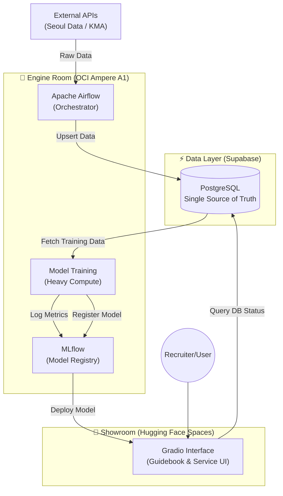

# Daily Seongsu (성수역 혼잡도 예측 서비스) - Professional MLOps Portfolio

**Target Goal**: 2027 Singapore Big Tech AI Logic / MLOps Engineer Recruitment.

**Daily Seongsu** is an end-to-end AI service designed to predict real-time crowding at Seongsu Station. It demonstrates a **Professional MLOps Pipeline** integrating **Hybrid Cloud Infrastructure** (OCI + Supabase + Hugging Face) and a **Dual-Purpose UI** architecture.

---

## 🏗️ System Architecture: The "Hybrid Engine"

We utilize a three-tier architecture to balance performance, scalability, and accessibility.



### 1. Engine Room (OCI Ampere A1)
- **Role**: Heavy lifting and Orchestration.
- **Components**: Apache Airflow (Dag Management), MLflow (Experiment Tracking), Docker Containers.
- **Hardware**: Oracle Cloud Infrastructure (ARM64).

### 2. Data Layer (Supabase)
- **Role**: Serverless Relational Database (PostgreSQL).
- **Features**: Robust `upsert` logic for data integrity, instant API generation.

### 3. Showroom (Hugging Face Spaces)
- **Role**: Public-facing Interface & Social Proof.
- **UI**: **Gradio** (Interactive MLOps Guidebook).
- **Goal**: High availability for global access (Recruiters, Users).

---

## 🗺️ MLOps Execution History & Plan (Level 1 - 10)

`Level` = 상위 성숙도 단계, `Step` = 각 Level 내부 실행 항목으로 구분합니다.

### 🟢 Level 1: Cloud Data Engineering (What We Did)
- **Problem**: Local JSON/CSV 중심 수집 방식은 중복 데이터, 확장성, 협업 측면에서 한계가 있었습니다.
- **What We Implemented**:
    - 수집 저장소를 로컬 파일에서 Supabase(PostgreSQL)로 전환 (`crawler/storage_supabase.py`).
    - 중복 삽입을 막기 위한 upsert 로직 정착.
    - API 연결 확인, 지하철/날씨 백필, Level 2 준비도 점검을 Guidebook에서 실행 가능하게 구성.
- **Outcome**: 데이터 수집 파이프라인이 "개인 로컬 스크립트" 수준에서 "공유 가능한 클라우드 파이프라인" 수준으로 전환되었습니다.

### 🟢 Level 2: Preprocessing & Feature Engineering (What We Did)
- **Problem**: 원시 데이터만으로는 예측 성능과 재현성이 낮고, 모델 입력 스키마가 불안정했습니다.
- **What We Implemented**:
    - Calendar/주말/공휴일 피처 생성, 지하철+날씨 데이터 병합, lag/rolling 피처 생성 (`crawler/pipeline.py`).
    - ML 학습용 Feature Store(`model_features`) 적재 루틴 구축.
    - 최종 무결성 검사(결측/범위/preview) 단계 추가.
- **Outcome**: 모델 학습에 바로 투입 가능한 표준화된 피처셋을 반복 생성할 수 있게 되었습니다.

### 🟢 Level 3: Data Quality Guidebook (What We Did)
- **Problem**: 학습 전 데이터 품질을 눈으로 확인하기 어려워, 문제 있는 데이터를 가지고 학습할 위험이 있었습니다.
- **What We Implemented**:
    - Gradio 기반 Level 3 Observer 탭에서 상관관계, 시계열 추세, 분포를 시각화 (`guidebook/tabs/level3_observer.py`).
    - Feature Store 점검 과정을 "학습 전 체크리스트"로 UI에 고정.
- **Outcome**: 모델 학습 전에 데이터 이상 징후를 먼저 발견하는 운영 습관을 만들었습니다.

### 🟢 Level 4: AutoML & Tuning Workflow (What We Did)
- **Problem**: 단일 모델 수작업 학습만으로는 어떤 모델이 실제로 좋은지 객관 비교가 어려웠습니다.
- **What We Implemented**:
    - Train/Test 분리, 다중 모델 비교(Linear/RandomForest/GradientBoosting), Grid Search 기반 튜닝 플로우 구축 (`guidebook/tabs/level4_automl.py`).
    - 비교 결과(RMSE) 시각화와 best model 선택 로직 반영.
- **Outcome**: 모델 선택을 직관이 아니라 비교 지표 기반으로 수행할 수 있게 되었습니다.

### 🟢 Level 5: Infrastructure as Code with Docker (What We Did)
- **Problem**: 실행 환경 차이로 로컬/서버 재현성이 떨어지고 배포 절차가 수동적이었습니다.
- **What We Implemented**:
    - `Dockerfile`, `docker-compose.yml`, `.dockerignore` 기반 컨테이너 실행 표준화.
    - Airflow 포함 인프라 구동 템플릿을 `infra/docker-compose.yml`에 정리.
- **Outcome**: "어디서 실행해도 같은 환경"을 보장하는 배포 기반을 확보했습니다.

### 🟢 Level 6: CI/CD Pipeline (What We Did)
- **Problem**: 코드 변경 시 테스트 누락/수동 배포로 인해 품질 리스크가 컸습니다.
- **What We Implemented**:
    - GitHub Actions CI 파이프라인 구성 (`.github/workflows/ci.yml`): 의존성 설치, Ruff, Pytest, 커버리지 리포트.
    - 배포 워크플로우 구성 (`.github/workflows/deploy.yml`): 서버 pull 및 컨테이너 재기동 자동화 구조 마련.
- **Outcome**: 코드 변경 -> 검증 -> 배포 흐름을 자동화 가능한 형태로 정착시켰습니다.

### ⚪ Level 7: Experiment Tracking (Planned)
- **Problem to Solve**: 실험 결과가 흩어져 있으면 "왜 이 모델을 선택했는지" 설명과 재현이 어렵습니다.
- **Plan**:
    - MLflow 기반 실험 추적 체계 도입 (run, param, metric, artifact).
    - RMSE/MAE 및 모델 산출물 중앙 기록.
    - Model Registry로 배포 대상 버전 관리.

### ⚪ Level 8: Data Versioning (Planned)
- **Problem to Solve**: 모델 결과와 학습 데이터 버전이 분리되면 재현성 보장이 어렵습니다.
- **Plan**:
    - DVC를 도입해 대용량 데이터 버전 이력 관리.
    - 모델 실험(run)과 데이터 버전을 연결해 재현성 확보.

### ⚪ Level 9: System Observability (Planned)
- **Problem to Solve**: 운영 중 장애/지연/드리프트를 늦게 발견하면 서비스 신뢰도가 급격히 떨어집니다.
- **Plan**:
    - API 지연, 파이프라인 상태, 실패 알림을 관측 지표로 표준화.
    - Gradio UI에서 상태를 즉시 확인 가능한 대시보드 제공.

### ⚪ Level 10: Full Orchestration (Planned)
- **Problem to Solve**: 수집-전처리-학습-배포가 분절되면 운영 비용이 증가하고 실패 복구가 어렵습니다.
- **Plan**:
    - Airflow DAG로 end-to-end 파이프라인 의존성 관리.
    - 조건 기반 자동 재학습/배포를 포함한 전체 라이프사이클 자동화.

---

## 🚀 Quick Start (Level 1)

### 1. Environment Setup
Create a `.env` file in `crawler/`:
```bash
SEOUL_DATA_API_KEY=your_key
KMA_API_KEY=your_key
SUPABASE_URL=your_url
SUPABASE_KEY=your_service_role_key
```

### 2. Run the Interactive Guidebook
```bash
# Install dependencies
pip install -r crawler/requirements.txt

# Launch Gradio App
python guidebook/gradio_app.py
```
Access the guide at `http://localhost:7860`.

---
*Last Updated: Jan 2026 | Maintainer: Daily Seongsu Team*
