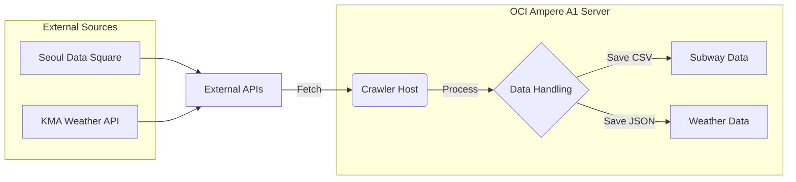

# Daily Seongsu System Status (Level 1 Complete)

이 문서는 현재 구현된 **Level 1 (Data Collection)** 단계의 시스템 흐름과 인프라 상태를 요약합니다.

## 1. System Architecture Flow

## 2. Infrastructure Layout (OCI ARM64)
현재 OCI Ampere A1 인스턴스 세팅을 위한 스크립트가 준비되어 있습니다.

- **Setup Scripts**:
  - `infra/setup_arm64.sh`: ARM64 호환 Docker, Python, OCI CLI 설치.
  - `infra/setup_network.sh`: 방화벽(iptables, firewalld) 오픈 (80, 443, 8501).
  - `infra/nginx.conf`: `daily-seongsu.bit-habit.com` 도메인 연결 및 SSL 설정 (Streamlit 프록시).

## 3. Data Collection Logic (Level 1)
데이터 수집기는 `crawler/` 디렉토리에서 동작하며, 두 가지 핵심 데이터를 수집하여 `web/public/data/`에 저장합니다.

| 분류 | 데이터 소스 | 수집 시점 | 저장 포맷 | 파일명 예시 |
| :--- | :--- | :--- | :--- | :--- |
| **지하철** | 서울 데이터 광장 (API) | 매일 실행 | CSV | `subway_20231024.csv` |
| **날씨** | 기상청 단기예보 (API) | 실행 시점 (실시간) | JSON | `weather_20231025_1400.json` |

### 주요 로직 설명
- **Subway**: `SeoulSubwayCollector` 클래스가 어제 날짜를 기준으로 성수역(2호선) 승하차 인원을 조회합니다.
- **Weather**: `WeatherCollector` 클래스가 성수동 격자 좌표(X=61, Y=126)를 기준으로 현재 기상 상태를 조회합니다.

## 4. Next Steps (Level 2~10)
다음 단계는 수집된 데이터를 바탕으로 예측 모델을 만들기 위한 **전처리(Level 2)** 및 대시보드 **시각화(Level 3)** 입니다.
현재 `task.md`와 `README.md`에 전체 10단계 로드맵이 상세히 기록되어 있습니다.
